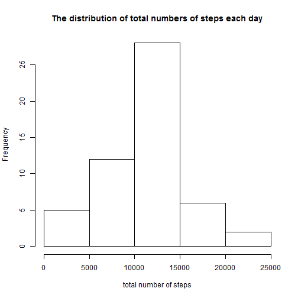
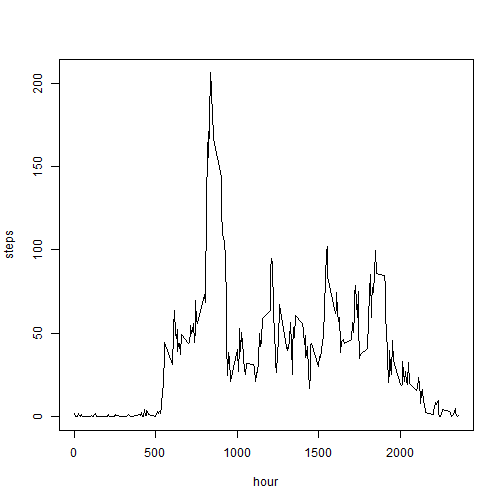
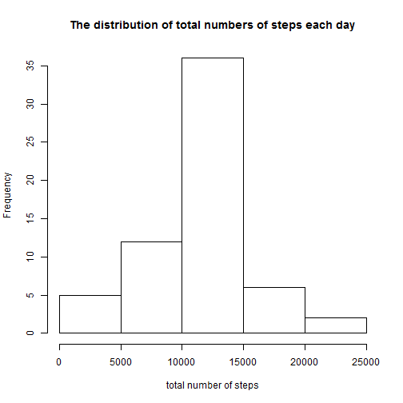
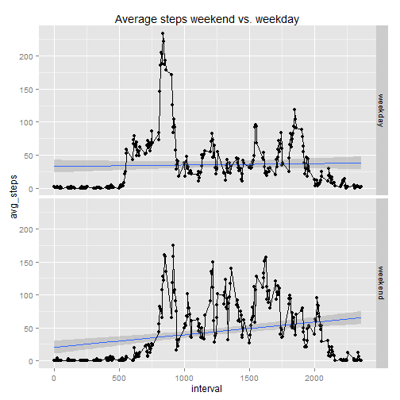

### Loading and preprocessing the data

First, load libraries

```r
library(downloader)
library(lubridate)
library(dplyr)
library(zoo)
library(ggplot2)
```


Load csv data

```r
URL <- "https://d396qusza40orc.cloudfront.net/repdata%2Fdata%2Factivity.zip"
destfolder <- getwd()
filesource <- "activity.zip"
download(URL, dest=filesource , mode="wb") 
unzip (filesource, exdir = destfolder)
activitydata <- read.csv("activity.csv", header=TRUE,sep=",", )  
```


Preprocess data

1. Put date in the correct format

```r
activitydata$date <- ymd(activitydata$date)
```


### What is mean total number of steps taken per day?

1. Calculate the total number of steps taken each day

```r
x <- sapply(split(activitydata$steps,activitydata$date ),sum)
```

2.  Make a histogram of the total number of steps taken each day

```r
hist(x, xlab = "total number of steps", main="The distribution of total numbers of steps each day")
```

 

3. Calculate and report the mean and median of the total number of steps taken per day

```r
mean(x, na.rm = TRUE)
```

```
## [1] 10766.19
```

```r
median(x, na.rm = TRUE)
```

```
## [1] 10765
```


### What is the average daily activity pattern?

1. A time series plot (i.e. type = "l") of the 5-minute interval (x-axis) and the average number of steps taken, averaged across all days (y-axis)

```r
groupbyhours <- group_by(activitydata[c("steps", "interval")], interval)
meanhourly <- summarise(groupbyhours, avg=mean(steps, na.rm=TRUE))
plot(meanhourly$interval, meanhourly$avg, type="l", xlab= "hour", ylab= "steps", col="black" , lwd=1)     
```

 

2. Which 5-minute interval, on average across all the days in the dataset, contains the maximum number of steps?


```r
max_avg <- meanhourly[order(-meanhourly$avg),]
max_avg[1,] #in interval
```

```
## Source: local data frame [1 x 2]
## 
##   interval      avg
## 1      835 206.1698
```

### Inputing missing values
There are a number of days/intervals where there are missing values (coded as NA). The presence of missing days may introduce bias into some calculations or summaries of the data.

1. The total number of missing values in the dataset (i.e. the total number of rows with NAs)


```r
sum(is.na(activitydata$steps))
```

```
## [1] 2304
```

2. One strategy for filling in all of the missing values in the dataset, is to simply fill in the missing values with mean value across all days.


```r
meansActivityVector<-tapply(activitydata$steps,activitydata$interval,mean,na.rm=TRUE) 
completeMeansActivityVector<-ifelse(is.na(activitydata$steps), meansActivityVector, activitydata$steps)
```


3. Create a new dataset that is equal to the original dataset but with the missing data filled in.


```r
#new dataset is called activitydatacomp
activitydatacomp<-data.frame(completeMeansActivityVector,activitydata$date,activitydata$interval) 
colnames(activitydatacomp) <- c( 'steps', 'date', 'interval')
str(activitydatacomp)
```

```
## 'data.frame':	17568 obs. of  3 variables:
##  $ steps   : num  1.717 0.3396 0.1321 0.1509 0.0755 ...
##  $ date    : POSIXct, format: "2012-10-01" "2012-10-01" ...
##  $ interval: int  0 5 10 15 20 25 30 35 40 45 ...
```

4. Make a histogram of the total number of steps taken each day and Calculate and report the mean and median total number of steps taken per day. Do these values differ from the estimates from the first part of the assignment? What is the impact of imputing missing data on the estimates of the total daily number of steps?


```r
xx <- sapply(split(activitydatacomp$steps,activitydatacomp$date ),sum)
hist(xx, xlab = "total number of steps", main="The distribution of total numbers of steps each day")
```

 

```r
mean(xx)
```

```
## [1] 10766.19
```

```r
median(xx)
```

```
## [1] 10766.19
```


### Are there differences in activity patterns between weekdays and weekends?


Step 1: Determine if a date belongs to a weekday of weekend

```r
activitydata <- mutate(activitydata, dayofweek = weekdays(activitydata$date))
activitydata$dayofweek[activitydata$dayofweek == "Monday" | activitydata$dayofweek == "Tuesday"  | activitydata$dayofweek == "Wednesday"  | activitydata$dayofweek == "Thursday" | activitydata$dayofweek == "Friday"] <- "weekday"
activitydata$dayofweek[activitydata$dayofweek == "Sunday" | activitydata$dayofweek == "Saturday"] <- "weekend"
```

Step 2: split data and generate image

```r
activitybyday <- group_by(activitydata[c("dayofweek", "interval", "steps")],dayofweek,interval)
averageactivitybyday <- summarize(activitybyday,avg_steps=mean(steps, na.rm=TRUE)) 

q <- qplot(interval, avg_steps, data = averageactivitybyday, facets=dayofweek~., geom=c("point","smooth"), method="lm")
q + geom_line()  + ggtitle("Average steps weekend vs. weekday")
```

 

### Session Info


```r
sessionInfo()
```

```
## R version 3.1.2 (2014-10-31)
## Platform: x86_64-w64-mingw32/x64 (64-bit)
## 
## locale:
## [1] LC_COLLATE=English_United States.1252 
## [2] LC_CTYPE=English_United States.1252   
## [3] LC_MONETARY=English_United States.1252
## [4] LC_NUMERIC=C                          
## [5] LC_TIME=English_United States.1252    
## 
## attached base packages:
## [1] stats     graphics  grDevices utils     datasets  methods   base     
## 
## other attached packages:
## [1] markdown_0.7.4  knitr_1.9       downloader_0.3  ggplot2_1.0.0  
## [5] zoo_1.7-12      dplyr_0.4.1     lubridate_1.3.3
## 
## loaded via a namespace (and not attached):
##  [1] assertthat_0.1   bitops_1.0-6     colorspace_1.2-4 DBI_0.3.1       
##  [5] digest_0.6.8     evaluate_0.5.5   formatR_1.1      grid_3.1.2      
##  [9] gtable_0.1.2     htmltools_0.2.6  httr_0.6.1       labeling_0.3    
## [13] lattice_0.20-30  lazyeval_0.1.10  magrittr_1.5     MASS_7.3-35     
## [17] memoise_0.2.1    mime_0.2         munsell_0.4.2    parallel_3.1.2  
## [21] plyr_1.8.1       proto_0.3-10     Rcpp_0.11.4      RCurl_1.95-4.5  
## [25] reshape2_1.4.1   rmarkdown_0.5.1  scales_0.2.4     stringr_0.6.2   
## [29] swirl_2.2.21     testthat_0.9.1   tools_3.1.2      yaml_2.1.13
```

